# Brutal Review of The Boring Revolution Deck

## Executive summary

This deck is **visually polished, rhetorically sharp, and strategically under-proven**. It looks like a premium keynote, but it behaves like a manifesto. Its central claim — that the best new Indian designers should choose banks over startups and big tech — is memorable, but the deck repeatedly jumps from **macro infrastructure scale** to **career advice** without proving the link. In plain terms: it has a thesis, but not yet a case. fileciteturn0file1

The strongest part of the deck is the **core intuition**. India really did build extraordinary payment infrastructure. Government-cited figures put UPI at roughly half of global real-time payment volume, December 2025 UPI value was about ₹28 lakh crore, and FY26 UPI value was reported around ₹308 lakh crore. That absolutely supports the claim that Indian banking and payments infrastructure matters at global scale. citeturn37news4turn30news0turn37news0

The weakest part of the deck is **evidence integrity**. Several headline numbers are either outdated, methodologically mixed, or too weakly sourced to survive a skeptical audience. The deck’s own “₹300 lakh crore” comparison to the federal budget is mathematically wrong: against India’s budgeted 2025/26 expenditure of ₹50.65 trillion, that is about **5.9x**, not “about ten times.” Tech layoff figures appear to mix trackers and time windows. Startup shutdown figures conflict with later official counts. The McKinsey slide uses specific percentage claims that are not supported by the accessible official McKinsey article text reviewed here. fileciteturn0file1 citeturn12news4turn34calculator0turn23view0turn20news3turn16view0turn17view0

The argument also has a strategic flaw: it says “banks own the rails,” which is directionally true, but it suppresses the equally important fact that **consumer-facing UPI UX is still dominated by third-party apps**. Reuters reported PhonePe at 47.8% and Google Pay at 37% of UPI volume in November 2024. So the leap from “bank-owned infrastructure” to “the best design career is at a bank” is far weaker than the slides imply. citeturn11news5turn26news0

My bottom-line judgment is blunt:

- **Narrative ambition:** strong.
- **Audience fit:** weak, because the audience is not explicitly defined.
- **Evidence and factual hygiene:** uneven to poor.
- **Visual design craft:** strong.
- **Slide architecture:** too repetitive in the first half, too underdeveloped in the second.
- **Recommendation:** **rewrite, do not lightly edit**. Keep the theme, rebuild the logic.

## Scope and factual baseline

The uploaded file is an 18-slide HTML deck titled **“The Boring Revolution”**. It argues that India’s best new designers should choose **banks**, not startups or big tech, and is structured in three parts: **Risk**, **Opportunity**, and **Work**, before a Verdict and Close slide. Audience type is **unspecified**. Presenter role is **unspecified**. Exact delivery context is **unspecified**. The deck length is not stated in the deck, but the uploaded file contains **18 slides**. fileciteturn0file1

The macro infrastructure premise is real. UPI’s scale is not hype. Government-cited parliamentary reporting said UPI accounts for about **49% of global real-time transactions**; Reuters reported UPI represented **83% of India’s digital payments volume in 2024**; December 2025 saw about **2,163 crore transactions** worth nearly **₹28 lakh crore**; and FY26 was reported at about **₹308 lakh crore** total value. Those are massive, serious numbers. citeturn37news4turn11news4turn30news0turn37news0

But the deck repeatedly overstates or mishandles specific claims:

The line that UPI moved **“₹300 lakh crore in 2025 — about ten times India’s annual federal budget”** is not supportable as written. India’s budgeted total expenditure for FY2025/26 was ₹50.65 trillion, and 300 divided by 50.65 is about **5.9**, not ten. Even if you allow rounding, that is not a close miss; it is a rhetorical exaggeration that will damage trust. fileciteturn0file1 citeturn12news4turn34calculator0

The startup-collapse section is also shaky. The deck cites **15,921** startup shutdowns in 2023 and **12,717** in 2024, but official later counts reported by the Commerce and Industry Ministry said **6,385 recognized startups** had been categorized as closed by October 31, 2025, and DPIIT-linked reporting described **about 3,903 closures in 2024** and **about 730 in 2025**. These are not directly equivalent scopes, which is precisely the problem: the deck does not define whether it means recognized startups, tech startups, all GST-registered ventures, or a third-party commercial database. A skeptical listener will spot that instantly. citeturn20news3turn20news0turn20news2

The Byju’s example is strong and supportable. Reuters reported that founder Byju Raveendran described the company — once valued at **$22 billion** — as **“worth zero.”** That story is legitimate evidence for startup fragility. But the edtech funding slide around it is not robust enough. Reuters, citing Tracxn, reported Indian edtech funding at **$5.37 billion in 2021** versus **$419 million in 2024**, a collapse of roughly **92.2%**. The deck’s own pair — **$4.1B to ~$0.6B** — tells a smaller and different story. The broad point is right; the exact numbers are not clean enough. citeturn19news0turn21news1turn35calculator0

The big-tech slide is one of the most methodologically dangerous. TrueUp reported **151,998** people impacted by tech layoffs in 2026 to date, and **245,953** in 2025. Separately, Reuters reported Layoffs.fyi was tracking over **103,000** cuts in 2026 and approaching the **124,000** seen throughout 2025; Times of India cited Layoffs.fyi at **112,732** by November 2025. That means different trackers can produce very different totals. The deck presents a clean year-by-year series as if it were one standardized dataset. It is not. citeturn23view0turn25view2turn36news1turn36news0

The McKinsey design slide partly stands up and partly does not. The official McKinsey article supports the claim that design quality correlates with business performance and explicitly says results held in **retail banking**; it also says top-quartile McKinsey Design Index companies posted **32 percentage points higher revenue growth** and **56 percentage points higher TRS growth** over five years overall. But the deck’s slide uses **+27% revenue** and **+18% total returns to shareholders** for “design-led retail banks.” Those exact figures were not visible in the accessible official article text reviewed here, so they require page-level support or removal. citeturn16view0turn17view0

The Paytm example is partially valid but outdated and under-framed. Reuters reported in March 2024 that Axis Bank, HDFC Bank, SBI, and Yes Bank were designated to support Paytm’s UPI operations after regulatory action against Paytm Payments Bank, which does support the “fintechs do not own the rails” point. But by April 2026, Reuters reported the RBI had **cancelled Paytm Payments Bank’s banking licence**. Your slide still frames this as a 2024 regulatory scare instead of the deeper 2026 endpoint. citeturn26news0turn26news4turn3news0

The most important blind spot is strategic, not numeric: the deck conflates **owns settlement rails** with **owns user experience power**. Reuters reported that PhonePe and Google Pay together processed **84.8% of UPI volume** in November 2024. So yes, banks are foundational to the system — but no, that does not automatically mean bank apps are where the best consumer payment design work lives. citeturn11news5turn26news0

## Core verdict on narrative and persuasion

At a high level, the story arc is easy to understand: first scare the audience away from the “default prestige paths,” then reveal India’s banking/payment scale as the hidden opportunity, then argue that the real prize is the work itself, then close with a bold slogan. That macro-arc is serviceable. fileciteturn0file1

The problem is that the deck **front-loads rhetoric and back-loads reasoning**. The thesis is declared on slide 2 before the audience is given a decision framework. The “Risk” section then spends four slides making the same emotional point in different ways: startups are dangerous, big tech is unstable, status has inverted, the old ladder is broken. By the time the deck reaches the truly interesting question — what kind of design work exists inside banking — it has already burned too much time on chest-thumping. fileciteturn0file1

This is why the deck currently feels more like a **positioning statement** than a decision-making tool. It tells the audience what to believe, but it does not help them decide. A strong persuasive deck should answer, in order: **What changed? Why does it matter? What criteria should I use? Why does your recommendation win on those criteria? What are the exceptions and trade-offs? What should I do next?** Your current deck skips the criteria and largely skips the trade-offs.

The biggest logic gap is the move from **national payment scale** to **designer career quality**. India can have world-class payment rails and still have mediocre design organizations inside many banks. Those are separate claims. The deck does not prove team quality, design leadership, research access, decision rights, shipping velocity, compensation competitiveness, or portfolio value. It proves that the sector is important, not that it is broadly the best seat for a designer.

The deck also relies on a **false binary**. “Banks vs startups vs big tech” is too crude for an informed audience. A designer choosing between ICICI, a Series C fintech, Google, a public SaaS company, and an AI infra startup is not comparing three clean categories. They are comparing org maturity, manager quality, product scope, equity risk, growth velocity, and role design. Your current narrative erases that nuance, which makes it sound smart at first and simplistic on reflection.

Because the audience is unspecified, the call-to-action is weak. If the audience is graduating designers, the CTA should be concrete: how to evaluate a banking role, which questions to ask, what good signals look like. If the audience is bank executives, the CTA should be about investing in design maturity. If the audience is recruiters, the CTA should be employer branding and org design. Instead, the current ending says “You’re early — not late,” which is emotionally nice but operationally empty. fileciteturn0file1

The final slogan — **“A startup asks you to bet on its survival. A bank lets you bet on India’s.”** — is memorable, but it is also the exact place where the deck becomes intellectually slippery. It replaces a career decision with a quasi-national loyalty framing. Some audiences will enjoy that flourish. Smart skeptical audiences will read it as manipulation. fileciteturn0file1

## Design and delivery critique

The deck is visually strong. The dark palette, restrained indigo accent, large type, and disciplined card system create a premium, modern, credible look. Unlike many career decks, it does not look amateur. It feels designed. That matters, and it gives you an advantage before you speak a word. fileciteturn0file1

But it is also a textbook case of **style outrunning substance**. Visually, the slides are elegant because they are sparse. Analytically, they are sparse because they hide their work. The custom charts often have **no axis labels, no source footnotes near the data, no methodology notes, no time-window explanations, and no denominator definitions**. They look authoritative while making it hard to audit the claim. That is rhetorically useful and intellectually dangerous.

Slide-level readability is physically good and semantically uneven. The text volume is low, so the slides are easy to read from a distance. But the semantic density is high: many slides compress a bold metaphor, a macro claim, and a career recommendation into one sentence. That can feel smart on first pass and slippery on second. The audience should not have to infer your whole logic from one slogan and a giant number.

The chart strategy needs a rewrite. Several slides use **illustrative graphics masquerading as evidence**:
- the “prestige ladder” is conceptual, not empirical;
- the “startup hopes for 1M” gap chart uses an invented comparison baseline;
- the “≈50% of world volume” donut makes a real claim but hides source details and date;
- the startup and tech-layoff bars imply methodological comparability that is not established. fileciteturn0file1 citeturn23view0turn20news3turn37news4

Tone-wise, the deck is controlled but overconfident. Lines like **“The startup boom was a 2021 mirage,” “Fintechs are tenants,”** and **“The highest-stakes canvas in the country”** are punchy, but collectively they create a smug voice. You are not just making a case; you are taunting other career paths. That can energize friendly audiences and alienate everyone else. fileciteturn0file1

Language and grammar are mostly clean. The problems are not grammatical; they are tonal and epistemic. The deck often uses **certainty language where it has evidence gaps**. It sounds fully settled where it should sound precise, bounded, and confident-with-caveats.

There are also a few presentation-system details that reveal a “showpiece deck” mindset over a practical presentation mindset. The HTML hides footer page numbers and sets navigation zones as non-focusable (`tabindex="-1"`), which is a small but telling sign that accessibility and operational clarity were secondary to appearance. fileciteturn0file1

## Slide-by-slide diagnosis and rewrite table

The table below reviews the uploaded 18-slide deck as delivered. Slide titles and structure are taken from the uploaded file. fileciteturn0file1

| Slide | Main issue | Severity | Exact rewrite text or replacement |
|---|---|---|---|
| Cover | Strong look, weak epistemic framing. It opens with conclusion and bravado before trust is earned. | Medium | **Title:** *Why banking deserves a serious look from designers in India* **Subtitle:** *A decision framework for evaluating banks, startups, and big tech in 2026* |
| Thesis | Declares “It’s a bank” too early. No criteria, no scope, no caveats. | High | Replace all three cards with: **Scale**, **Team quality**, **Decision rights**, **Learning velocity**. Add line: *This deck argues that some banks now outperform default prestige paths on these criteria — not that every bank does.* |
| Part One divider | Decorative, expendable. Burns time without advancing the case. | Low | **Cut entirely.** Use a hard verbal transition instead: *Before I tell you why banks matter, I need to show why the old defaults are no longer automatic wins.* |
| Prestige ladder | Unsupported conceptual chart presented like evidence. | High | Replace with a sourced comparison slide: **Title:** *The old prestige shortcuts are less reliable than they look* **Bullets:** *Startup outcomes remain highly dispersed; tech layoffs remain material; neither path is a guaranteed “safe” option.* |
| Startup mirage | Too absolute, numbers are weakly scoped, and the line “2021 was the anomaly” overstates what the evidence proves. | High | **Title:** *Startup risk is real — but define the risk correctly* **Bullets:** *High-profile failures changed perception.* *Official and third-party closure data use different scopes, so cite the methodology.* *Do not sell “startup doom”; sell “higher variance.”* |
| Big tech | Mixed tracker problem. Apples-to-oranges time windows create a fake trend. | High | **Title:** *Big tech still offers upside — but it is no longer a guaranteed floor* **Bullets:** *Layoff trackers disagree materially by source and time window.* *Use one tracker only.* *Explain whether your point is volatility, hiring slowdown, or AI-led org redesign.* |
| Part Two divider | Repeats the pattern of decorative sectioning. | Low | **Cut entirely.** Move directly into the “why banks matter in India specifically” slide. |
| UPI hero | Good core evidence, but chart needs labels and context. | Medium | **Title:** *India built payment infrastructure at extraordinary scale* **Footer note:** *UPI volume and value, source/date shown on-slide.* Add mini-note: *Infrastructure scale is necessary, not sufficient, for a good design career.* |
| Scale | Strong fact, weak inference. It jumps from market scale to career thesis. Also hides the front-end app concentration problem. | High | **Title:** *The rails are bank-linked. The user experience is still contested.* **Bullets:** *UPI is enormous.* *But consumer UX power still sits heavily with third-party apps.* *So the best design seat is not “any bank”; it is the team with real product leverage.* |
| One bank | Single-company case study is fine, but the comparison to “≈1M a startup hopes for” is invented and unserious. | High | **Title:** *A large bank can offer immediate production scale* **Bullets:** *Use a real bank case study with page-level citation.* *Drop the hypothetical startup comparison.* *Explain why scale matters to a designer: experimentation, edge cases, accessibility, trust, and operational complexity.* |
| Moat | The metaphor is memorable, but the claim is too neat and the Paytm case is outdated. | High | **Title:** *Licences and settlement relationships create structural dependence* **Bullets:** *The Paytm case shows front-end brands can depend on bank-linked infrastructure.* *Update the case through the 2026 licence cancellation.* *Do not imply this automatically makes bank design roles superior.* |
| Designers | Unsupported “~10% maturity” and unsupported 27/18 McKinsey figures. Great strategic point, weak proof. | High | **Title:** *The real opportunity is maturity gap, not just hiring* **Bullets:** *Design quality in banking is uneven.* *That creates room for outsized influence in the right teams.* *Prove this with actual org examples, job postings, reporting lines, and shipped work — not only macro stats.* |
| Part Three divider | Decorative again. | Low | **Cut entirely.** |
| Scale of work | One of the better slides, but still abstract. It needs one concrete user or product example. | Medium | **Title:** *At banking scale, small UX decisions become system-level decisions* **Bullets:** *Clarity affects trust.* *Error prevention affects financial harm.* *Accessibility affects who can actually use the product.* |
| Stakes | Strongest conceptual slide in the deck. It finally sounds like a designer talking about design. | Medium | Keep the frame, rewrite tighter: **Title:** *In financial UX, trust is the product* **Cards:** *Clarity over cleverness* / *Error prevention over delight theater* / *Confidence over engagement vanity metrics* |
| Briefs | Good instincts, too absolute. “No startup can hand you” is false. | Medium | **Title:** *These are banking-heavy design problems, not bank-exclusive problems* **Bullets:** *Inclusive onboarding* *Multilingual trust flows* *Disputes, KYC, lending, and fraud prevention under real regulatory constraints* |
| Verdict | Great slogan, but it closes emotionally instead of logically. | High | **Title:** *The bet is not “bank instead of everything else.” The bet is “choose teams with real user impact and real organizational leverage.”* |
| Close and sources | CTA is vague. Source page is aggregated, not claim-mapped. This would not survive a hostile Q&A. | High | **Replace CTA:** *If you are choosing roles in 2026, interview three banks you would normally ignore — and score them on team quality, scope, shipping speed, design leadership, and user stakes.* **Replace source block:** *Claim-by-claim appendix with slide/page citations.* |

## Recommended restructure and timing

The current 18-slide deck is **too repetitive for 10–12 minutes**, merely acceptable for **15–18 minutes**, and only fully comfortable at **18–20 minutes**. The reason is not text density; it is **argument redundancy**. The first half says the same thing too many times, while the second half arrives too late at the part the audience actually cares about: what the work is, how to evaluate it, and what to do next. fileciteturn0file1

My recommendation is to convert this into a **10-slide core deck plus appendix**, not to preserve all 18 slides. The revised sequence should be:

1. Frame the decision  
2. Explain what changed in the usual career paths  
3. Give the criteria for evaluating roles  
4. Show why India’s banking/payment infrastructure matters  
5. Separate rail ownership from front-end UX ownership  
6. Show what high-stakes banking design work actually looks like  
7. Use one careful bank case study  
8. Address objections and trade-offs  
9. Give an evaluation rubric  
10. Close with a concrete CTA

```mermaid
flowchart LR
    A[Frame the decision] --> B[What changed in default paths]
    B --> C[Decision criteria]
    C --> D[Why banking matters in India]
    D --> E[Rails versus user experience]
    E --> F[What designers actually work on]
    F --> G[Case study with caveats]
    G --> H[Objections and trade-offs]
    H --> I[Role-evaluation rubric]
    I --> J[Concrete CTA]
```

For delivery, a disciplined **14-minute version** is the sweet spot:

```mermaid
gantt
    title Recommended timing for a 14-minute rewrite
    dateFormat X
    axisFormat %s sec
    section Opening
    Frame the decision           :a1, 0, 45
    What changed                 :a2, 45, 75
    Decision criteria            :a3, 120, 45
    section Core case
    Why banking matters          :a4, 165, 90
    Rails versus UX ownership    :a5, 255, 75
    What the work is             :a6, 330, 90
    Bank case study              :a7, 420, 75
    section Close
    Objections and trade-offs    :a8, 495, 105
    Evaluation rubric            :a9, 600, 90
    CTA and close                :a10, 690, 30
```

For a **10-minute** version, cut the standalone case-study slide and compress objections into one card slide. For a **20-minute** version, keep an appendix with source-by-source claim backup, methodology notes, and one deeper bank comparison.

## Sample rewritten slides

The sample slides below are written for an **audience-agnostic** version, since the current target audience is unknown. They are designed to preserve your theme while removing the most damaging overclaims.

### Sample slide

**Title**  
Where should a new designer place their bet in 2026?

**Body**
- The default prestige paths are less automatic than they used to be.
- India’s banking and payments infrastructure now operates at extraordinary scale.
- But scale alone is not the answer.
- The real question is: **Which roles offer the best mix of user impact, decision rights, learning velocity, and team quality?**

**Visual**  
Four-quadrant scorecard with the headings: **Impact**, **Decision rights**, **Learning**, **Team quality**.

**Speaker notes**  
“I’m not asking you to romanticize banks. I’m asking you to evaluate roles more rigorously. For years, many designers defaulted to startups for upside or big tech for safety. In 2026, those shortcuts are weaker. So this deck is not ‘banks are always better.’ It is ‘banks now deserve a serious, evidence-based look.’” citeturn23view0turn20news0turn11news4

### Sample slide

**Title**  
India built payment infrastructure at extraordinary scale

**Body**
- Government-cited reporting said UPI accounts for about **49% of global real-time payment volume**.
- December 2025 UPI value reached nearly **₹28 lakh crore**.
- FY26 UPI value was reported around **₹308 lakh crore**.
- That makes banking and payments in India strategically important. It does **not** yet prove that every bank is a great design workplace.

**Visual**  
A clean slope chart or bar chart with labeled dates, values, and source note on the slide itself.

**Speaker notes**  
“This is the strongest part of the thesis. The infrastructure is real. The volume is real. The national importance is real. So if someone tells you banking is boring in the sense of being small or irrelevant, that’s simply wrong. The harder question is what this infrastructure reality means for designers inside specific organizations.” citeturn37news4turn30news0turn37news0

### Sample slide

**Title**  
Owning the rails is not the same as owning the user experience

**Body**
- Banks and NPCI sit under the system’s trust, settlement, and regulatory backbone.
- But consumer-facing UPI usage is still heavily concentrated in third-party apps.
- In November 2024, Reuters reported PhonePe at **47.8%** and Google Pay at **37%** of UPI volume.
- So the right conclusion is not “join any bank.” The right conclusion is: **find the team with real product leverage in a strategically important domain.**

**Visual**  
Split diagram: left side **Infrastructure power**, right side **Consumer UX power**.

**Speaker notes**  
“This is the slide your current deck is missing. Without it, the story is too convenient. Yes, banks matter structurally. But if the best consumer payment design work is concentrated in non-bank apps, we have to be honest about that. That honesty makes the rest of the argument stronger, not weaker.” citeturn11news5turn26news0

### Sample slide

**Title**  
What should a designer do with this thesis?

**Body**
- Interview at least **three institutions you would normally dismiss**.
- Ask six questions:
  - Who owns product decisions?
  - How many designers and researchers are on the team?
  - What shipped in the last 12 months?
  - How is design measured?
  - What user problems are highest-stakes?
  - How much influence does design have outside the mockup stage?
- Choose the role that wins on **scope, support, and growth**, not on logo prestige alone.

**Visual**  
Checklist card with six interview questions.

**Speaker notes**  
“If this deck changes nothing else, it should change the quality of the questions people ask. The point is not to become pro-bank by ideology. The point is to stop using prestige shorthand and start using evidence about the actual team, actual work, and actual leverage.”  

## Final QA checklist and limitations

Before this deck is shown publicly, I would require the following QA pass.

### Final QA checklist

- Replace every aggregate source footer with **claim-level citations**.
- Use **one layoff tracker only** on any multi-year layoff chart.
- Define the scope for every startup-shutdown number.
- Correct the federal-budget comparison.
- Remove or prove the McKinsey **27% / 18%** figures.
- Update the Paytm case through the **2026 licence cancellation**.
- Add one slide that explicitly distinguishes **infrastructure power** from **front-end design power**.
- Replace decorative divider slides with substantive content or cut them.
- Remove invented comparison baselines like **“a startup hopes for 1M.”**
- Rewrite the closing so the CTA is operational, not just emotional.
- Sanity-check every headline for overstatement, especially words like **best**, **only**, **everyone**, **nobody**, **highest**, and **can’t**.
- Add accessibility basics if the HTML version will be used directly, including visible page references and keyboard-focusable navigation. fileciteturn0file1

### Open questions and limitations

A few claims could not be fully validated from accessible primary materials during this review and should be treated as **unverified until page-cited**:

- the exact ICICI annual report figures used on the single-bank case-study slide;
- the exact PwC basis for the **1B/day by FY27** projection;
- the exact provenance of the deck’s startup-shutdown totals for 2023 and 2024;
- the exact source behind the deck’s **“~10% top-tier design maturity”** claim;
- the exact McKinsey page supporting **+27% revenue** and **+18% TRS** for retail banks specifically. fileciteturn0file1 citeturn16view0turn17view0

The brutal but fair conclusion is this: **the deck has a compelling premise and a compelling aesthetic, but it is not yet credible enough to be truly persuasive.** Right now it wins applause from friendly listeners and loses ground with anyone analytical. Rebuilt with cleaner evidence, explicit caveats, a narrower thesis, and a real decision rubric, it could become excellent. As it stands, it is a beautiful overreach.